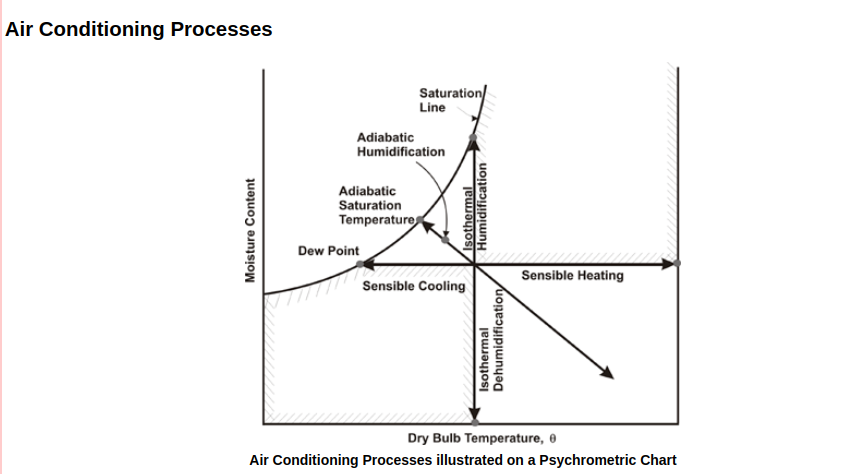

# Typical air-conditioning processes

### Examples of typical A/C processes 

These are examples that can be found on chapter 1.10 of 2017 ASHRAE Fundamentals handbook. 

Notebooks:

* Moist Air Sensible Heating or Cooling
* Moist Air Cooling and Dehumidification
* Adiabatic Mixing of Two Moist Airstreams
* Adiabatic Mixing of Water Injected into Moist air
* Space Heat Absoprtion and Moist Air Moisture Gains

_In my opinion, I think is much better to try to solve them out first by hand and with a chart 1 prior to use python and external libraries to get the data._

