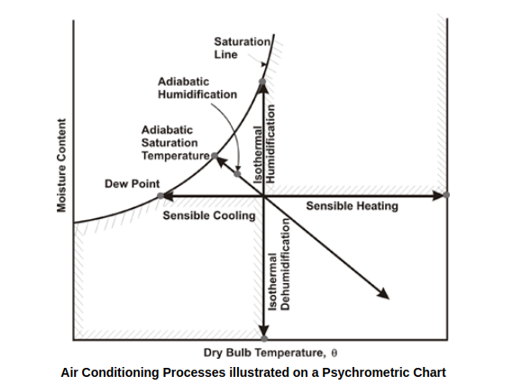

# Typical A/C processes 

  

### These are examples that can be found on chapter 1.10 of 2017 ASHRAE Fundamentals handbook. 

**Notebooks:**

* Moist Air Sensible Heating or Cooling
* Moist Air Cooling and Dehumidification
* Adiabatic Mixing of Two Moist Airstreams
* Adiabatic Mixing of Water Injected into Moist air
* Space Heat Absoprtion and Moist Air Moisture Gains

For calculations purpouses psychrolib is utilised. According to project's repository:

_"PsychroLib is a software library to enable the calculation of psychrometric properties of moist and dry air"_ https://github.com/psychrometrics/psychrolib.

For displaying the psychrometrics charts and the especific properties of every example, psychrochart is utilised. According to project's repository: 

psychrochart is _"A python 3 library to make psychrometric charts and overlay information on them. It implements a useful collection of psychrometric equations for moisture and humid air calculations, and the generation of beautiful and high customizable psychrometric charts in SVG with matplotlib"_ https://github.com/azogue/psychrochart

PS.
In my opinion, I think is better to try to solve the examples manually at first following the handbook and using a psychrometric chart (sea-level) prior to use tools and external libraries; thus maximizing learning.

 

