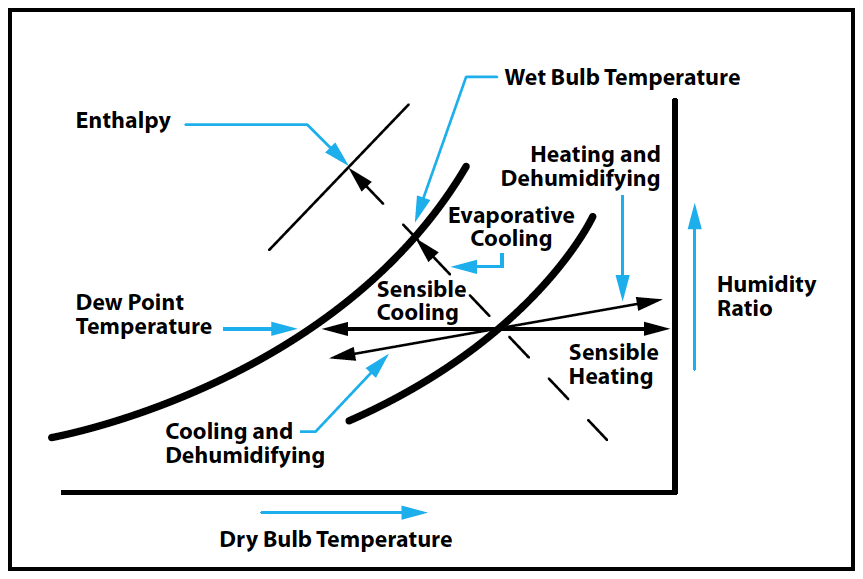
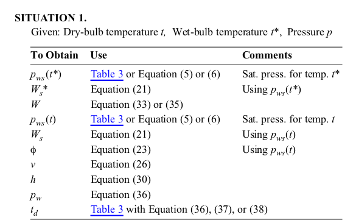
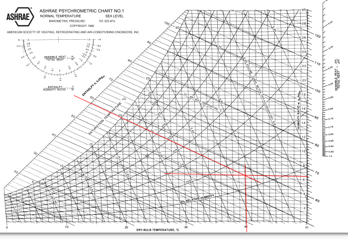
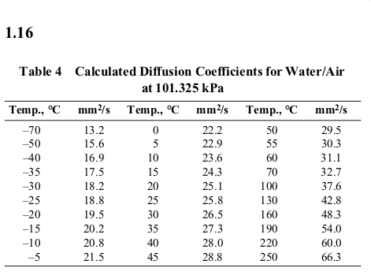
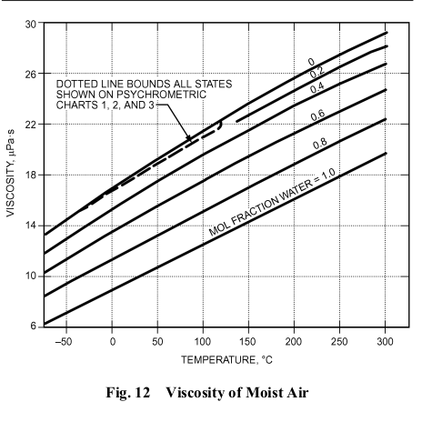
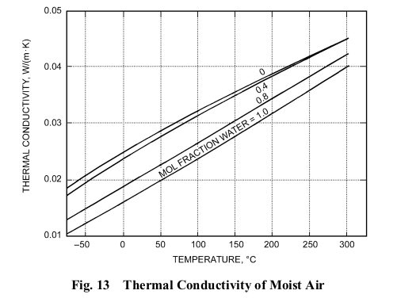

* [PSYCHROMETRICS](#psychrometrics)
  + [1 Dry and moist air composition](#1-dry-and-moist-air-composition)
  + [2 Standard atmosphere](#2-standard-atmosphere)
  + [3 Moist air thermodynamic properties](#3-moist-air-thermodynamic-properties)
  + [4 Thermodynamic properties of water at saturation](#4-thermodynamic-properties-of-water-at-saturation)
  + [5 Humidity parameters](#5-Humidity-parameters)
  + [6 Perfect gas relationships for dry and moist air](#6-perfect-gas-relationships-for-dry-and-moist-air)
  + [7 Thermodynamic wet-bulb and dew-point temperature](#7-thermodynamic-wet-bulb-and-dew-point-temperature)
  + [8 Numerical Calculation of Moist Air Properties](#8-numerical-calculation-of-moist-air-properties)
  + [9 Psychrometric charts](#9-psychrometric-charts)
  + [Example 1](#example-1)
  + [10 Typical air-conditioning processes](#10-typical-air-conditioning-processes)
  + [11 Transport properties of moist air](#11-transport-properties-of-moist-air)

# PSYCHROMETRICS
Psychrometrics are the study of physical and thermodynamic properties of moist air, i.e.,
the use of thermodynamic properties to analyse conditions and processes involving moist air.

## 1 Dry and moist air composition
### Atmospheric air

Contains gaseous components as well as water vapor and miscellaneous contaminants.

### Dry air

Atmospheric air with all water vapor and contaminants removed. 

### Moist air

Mixture of dry air and water vapor. The amount of water vapor varies from zero (dry air) to a maximum that 
depends on temperature and pressure. 

### Saturation

State of equilibrium between moist air and condensed water phase (liquid or solid).  

## 2 Standard atmosphere
Temperature and barometric pressure of air varies with altitude and with local geographic and weather conditions.
The standard atmosphere allows to estimate properties at various altitudes.

### Standard values

Temperature  --->  15C°

Barometric pressure  --->  101.325 kPa

Gravity  --->  9.80665 m/s2

Lower atmophere is assumed to consist of dry air that behaves as a perfect gas

## 3 Moist air thermodynamic properties
Based on International Temperature Scale (ITS-90). Thermodynamic Properties of Moist Air at Standard Atmospheric Pressure, 101.325kPa

* Humidity ratio at saturation **( Ws )**   

* Specific volume of dry air **( Vda )**

* Specific volume difference of Vs - Vda **( Vas )**

* Specific volume of moist air at saturation **( Vs )**
 
* Specific enthalpy of dry air **( hda )**

* Specific enthalpy difference of Hs - Hda **( has )** 

* Specific enthalpy of moist air at saturation **( hs )**

* Specific entropy of dry air **( Sda )**

* Specific entropy of moist air at saturation **( Ss )** 

## 4 Thermodynamic properties of water at saturation
Based on ITS-90. For detailed formulas refered to ASHRAE fundamentals, 2017.

The water vapor saturation pressure ( pws ) is required to determine
a number of moist air properties, principally the saturation humidity ratio ( Ws )

* Absolute pressure (saturation pressure)  **( Pws )**
* Vapor pressure ( ps ) can be used in equations in place of pws with very little error: 

		ps = Xws P 

where x ws is the mole fraction of water vapor in saturated moist air
at temperature t and pressure p, and p is the total barometric pressure
of moist air.

## 5 Humidity parameters

### Basic parameters

#### Humidity ratio _W_ (or mixing ratio): 
Ratio of the mass of water vapor to the mass of dry air:

	W = M w /M da

Where equals the mole fraction ratio x w /x da multiplied by the ratio of
molecular masses:

	W = 0.621945 ( xw / xda ) 

#### Specific humidity:
Ratio of the mass of water vapor to total mass of moist air sample 

	Y = M w /(M w + M da )

In terms of humidity ratio:

	Y =  W / (1 + W)

#### Absolute humidity (water vapor density): 
Ratio of the mass of water vapor to total volume sample 

	d v = M w / V

#### Density (of a moist air mixture):
Ratio of total mass to total volume

	p = ( M da + M w ) / V = ( 1/v )( 1 + W )

Where v is the moist air specific volume, m3/kgda

### Humidity parameters involving saturation (moist air saturation)

#### Saturation humidity ratio _W s ( t, p )_

Humidity ratio of moist air saturated to water at a same temperature and pressure 

#### Relative humidity _RH_

Ratio of water vapor partial pressure in moist air at dew-point pressure and temperature to 
the reference saturation water vapor partial pressure ar dry-bulb pressure and temperature.

In layman's terms, tells us how much water vapor is in the air, compared to how much it could hold at that temperature. It is shown as a percent

	( phi ) = ( p wv _ enh /p wvs _ ref | p,t ) = [ f ( p, t dp ) e (t dp ) ] / [ f ( p, t db ) e ( t db )]

#### Dew-point temperature _(td)_

Temperature of moist air saturated at pressure, with same humidity ratio W as that of the
given sample of moist air.  

Put simply, is the temperature the air needs to be cooled to (at constant pressure) in order to achieve a relative humidity (RH) of 100%.

	W s ( p, t d ) = W

#### Thermodynamic wet-bulb temperature _(t)_ 

Temperature at which water, by evaporating into moist air at dry-bulb temperature and humidity ratio,
can bring air to saturation adiabatically at the same temperture while total pressure is constant. 

## 6 Perfect gas relationships for dry and moist air

When moist air is considered a mixture of independent perfect gases (dry air and water vapor), perfect gas equation (pV=nRT)  can be 
assumed for each.

### Dry Air

	p ( da ) V = n ( da ) RT

### Water vapor
 
	p ( w ) V = n ( w ) RT

### The mixture also obeys the perfect gas equation:

	( pda + pw ) V = ( nda + nw ) RT

###  Humidity ratio (_W_) (p = pda + pw)

	W = 0.621945 ( pw / p - pw )

### Saturation humidity ration (_Ws_) is:

	Ws = 0.621945 ( pws / p - pws )

Where:

pda = Partial pressure of dry air

pw = Partial pressure of water vapor

V = Total mixture volume

nda  = Number of moles of dry air

nw = Number of moles of water vapor

R = Universal gas constant, 8314.472 (kmol.K) 
 
T = Absolute temperature, K 

The enthalpy _(h)_ of a mixture of perfect gases equals the sum of the
individual partial enthalpies of the components. Specific enthalpy of moist air equals:

	h = h da + W hg

Where h da = Specific h for dry air in kJ /kgda and hg is the specific enthalpy for saturated
water vapor un kg / kgw at the mixture's temperature. As an aprox: 

	h da =  1.006t
	h g  =  2501 + 1.86t

where _t_ = dry-bul temperature in C°. The moist air specific
enthalpy in kJ / kg da then becomes:

	h = 1.006t + W ( 2501 +  1.86t )  

## 7 Thermodynamic wet-bulb and dew-point temperature

For any moist air, a temperature _t*_ exist at which liquid water evaporates into the air to bring it 
to saturation at the same _t_ and total pressure (Harrison, 1965). During this adiabatic saturation, 
saturated air is expelled at a _t_ = to that of the injected water. 

In this constant-pressure process:

_W_ = increases from initial _W_ to _Ws_

_h_ = increases from _h_ to _hs_

Energy conservation _(h)_ requires: 
	
	h + ( Ws  – W ) hw = h s 

The value of _t_ that satifies _h_, _W_, and _p_ is the **thermodynamic wet-bulb temperature**

Past equation is exact because it defines wet-bulb temperature _t_. Substituing the h, hs, and ( _h*w_ = 4.186_t_ ) into last _h_ equation for _W_ solving equals: 

	W  =  ( 2501 – 2.326t* ) W*s  –  1.006 ( t – t* ) / 2501 + 1.86t – 4.186t*

Where _t_ and _t*_ are in C°. Below freezing, the corresponding equation is:

	h*w = -333.4 + 2.1 t* 

	W = ( 2830 - 0.24t* ) W*s - 1.0006 ( t - t* ) / 2830 + 1.86t - 2.1t* 

The Dew-point temperature _td_ of moist air with _W_ and _p_ was defined as _td_ ( _p_, _W_ ) of _Ws_ ( _p_. _td_ )

This reduces to: 

	pws ( td ) = pw = ( pW ) / ( 0.621 945 + W )

## 8 Numerical Calculation of Moist Air Properties 

## 9 Psychrometric charts

A psychrometric chart graphically represents the thermodynamic properties of moist air.

A chart with coordinates of _h_ and _W_  ratio provides convenient graphical solutions of many moist air problems.

* ASHRAE charts 1, 2, 3 and 4 are for sea-level _p_ (101.325 kPa) 
* Chart 5 is for 750m altitude (92.634 kPa)
* Chart 6 is for 1500m altitude (84.54 kPa) 
* Chart 7 is for 2250m altitude (77.058 kPa) 

### Example 1

Moist air exists at 40°C dry-bulb temperature, 20°C thermodynamic wet-bulb temperature, and 101.325 kPa pressure. Determine the
humidity ratio, enthalpy, dew-point temperature, relative humidity, and specific volume.

_W_ ? / _h_ ? / _RH_ ? / _v_ ?

Chart 1 displaying properties:

_W_ = 6.5 gw / Kg da 

_h_ = 58 kJ / kg da

_RH_ = 14 % 

_v_= 0.896 m3 / kg da

## 10 Typical air-conditioning processes 

ASHRAE psychrometrics charts can be used to solve several process problem involving moist air. Following examples are at constant total pressure, 101.325 kPa

Please find notebooks in the examples folder with guided resolutions as shown in chapter 1 of 2017 ASHRAE fundamentals

## 11 Transport properties of moist air 

For certain scientific and experimental many moist air properties are important. Generally classified as "Transport Properties of Moist Air" these properties are categorised as:
* Diffusion coefficient
* Viscosity
* Thermal conductivity 
* Thermal diffusion factor

